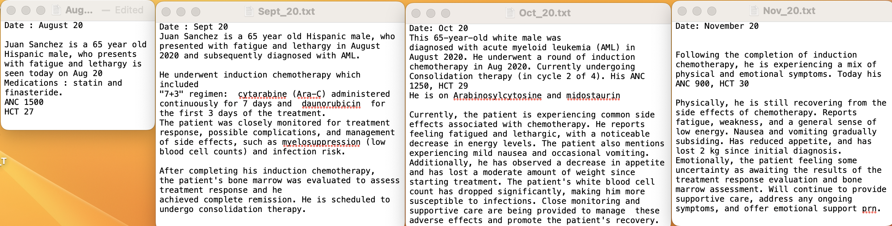
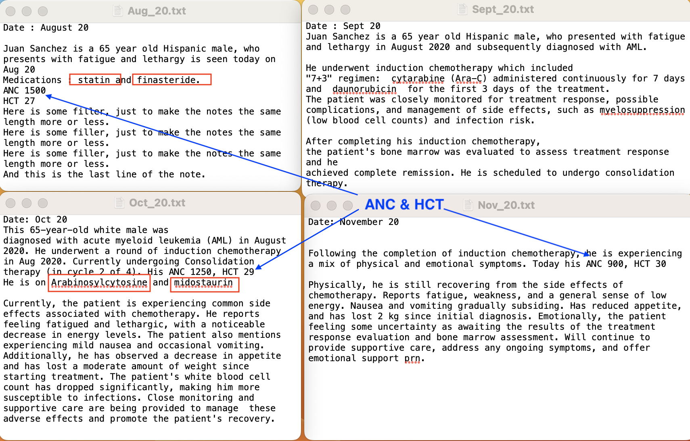

# Coding

A number of use cases are considered where chatGPT may prove useful for clinicians:
1. Oncologists
2. Primary Care Physicians

Other use cases can be considered administrative:
1. A patient has a medical concern and is interested in finding out when a particular is open.


The following code uses the chatGPT API and performs the following :
1. Read a clinic note
2. Identify Medical Considerations based on Clinical Note
	- Determine 5-7 medical considerations (one or two words in length) 
3. Create Assessment and Plan
	- Include relevant preventive health recommendations
4. Identify the MEDICATIONS - and the relevant MEDICAL CONDITIONS
5. Highlight the MEDICATIONS in the note
6. Preventive Care Recommendations - as Written by Physician  
	- Extract relevant information to form recommendations regarding preventive healthcare.
	- 3-5 areas appropriate for the patient described in the clinical note.

7. Show Specific Reasons for Recommendations
	- Medical Consideration
    	- Recommendation
    	- Reason for Recommendation

```Preventive Health Recommendations

1. Cardiovascular Disease Prevention
    a. The patient reports a family history of cardiovascular disease, with her father having a heart attack in his late 60s.
    b. Medical History: The patient has a history of hypertension and hyperlipidemia, both of which are well-managed with medications.
    c. Assessment and Plan: Recommend regular cardiovascular screening, including blood pressure and cholesterol checks, as well as lifestyle modifications such as smoking cessation and regular exercise.

2. Cancer Screening
    a. Family History: The patient's mother had colon cancer but is currently in remission.
    b. Assessment and Plan: Recommend regular colon cancer screening, such as colonoscopy, as well as breast cancer screening, such as mammography.

3. Smoking Cessation
    a. Social History: The patient smokes 1/2 ppd.
    b. Assessment and Plan: Recommend smoking cessation interventions, such as nicotine replacement therapy or counseling, to reduce the risk of lung cancer and other smoking-related illnesses.
```

The notes are seen here:



In the second note, we have highlighted the medications that are referenced in the note, as well as the ANC and HCT values.




 
