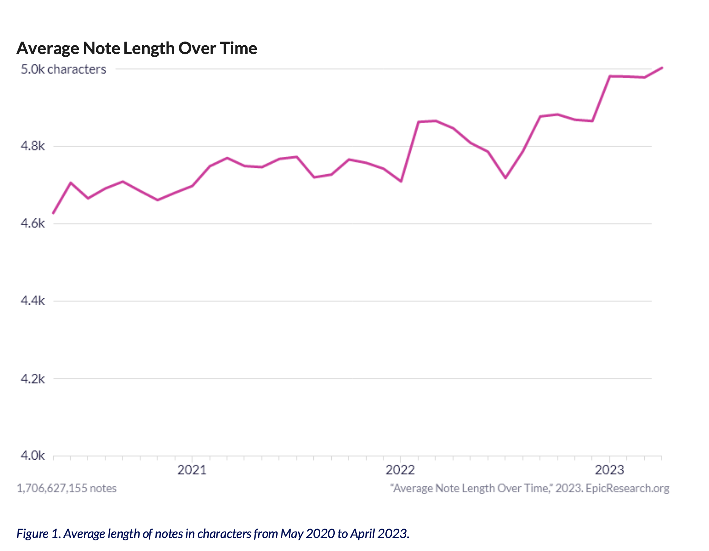

# ChatGPT use cases for Physicians  

 

 

 

### Use Cases 

Description | Specialty | Use Case | Assigned To | Status
:---:|:-----:|:------------:|:-----------:|:-----------:
`Synopsis of Multiple Clinic Notes`| [Oncology](https://github.com/mvigoda/Coding/blob/master/Cancer_Patient_Synopsis.ipynb) | [Synopsis of Multiple Clinic Notes](#synopsis-of-multiple-clinic-notes) |   | 🟩
`Preventive Care Recommendations`| [PCP](https://github.com/mvigoda/Coding/blob/master/Infer_Preventive_Health_Recommendations.ipynb) | [PCP Annual Visit](#pcp-annual-visit-and-preventive-care-recommendations) |   | 🟩
`What has Happened Since...`| [Specialty](https://github.com/mvigoda/Coding/blob/master/What_has_happened_since_last_time_v_3.ipynb) | (#What-has-Happened) |   | 🟩

Chat GPT can be helpful for physicians reviewing clinical records in several ways:

### Efficient Data Extraction   
  Chat GPT can assist in automatically extracting relevant data points, such as:
 
- Patient Demographics
- Medical History
- Medications
- Lab Results
- Diagnoses  
    

In this manner, it can be used to **analyze text and generate structured summaries**.

### Decision Support  
- Analyzing clinical records and offering insights based on patterns, guidelines, and previous similar cases. 
- Identify potential drug interactions
- Flag abnormal test results  
- Suggest further diagnostic tests or treatment options  
- Provide evidence-based recommendations  

### Documentation Assistance  
- Aid in generating accurate and comprehensive clinical notes by analyzing the clinical records and providing suggestions for relevant information to include
- Help with formatting, grammar, and terminology consistency, resulting in more efficient and standardized documentation.

### Natural Language Interface  
- Ask questions in plain language, such as "What was the patient's blood pressure during the last visit?" or "Has the patient reported any allergies?"
- Interpret these queries, search the clinical records, and provide relevant answers, saving time and improving accessibility to patient information.

## Synopsis of Multiple Clinic Notes  

 

A number of use cases are considered where chatGPT may prove useful for clinicians:
1. [Cancer Patient Synopsis of Multiple Clinic Notes](https://github.com/mvigoda/Coding/blob/master/Cancer_Patient_Synopsis.ipynb)
	- Multiple clinic notes for the same patient 
	- Organize them in chronological order
	- Extract relevant data from each visit to provide a synopsis

Other use cases can be considered administrative:
1. A patient has a medical concern and is interested in finding out when a particular is open.

## PCP Annual Visit - and Preventive Care Recommendations

[PCP Annual Visit - and Preventive Care Recommendations](https://github.com/mvigoda/Coding/blob/master/Infer_Preventive_Health_Recommendations.ipynb)

The following code uses the chatGPT API and performs the following :
1. Read a clinic note
2. Identify Medical Considerations based on Clinical Note
	- Determine 5-7 medical considerations (one or two words in length) 
3. Create Assessment and Plan
	- Include relevant preventive health recommendations
4. Identify the MEDICATIONS - and the relevant MEDICAL CONDITIONS
5. Highlight the MEDICATIONS in the note
6. Preventive Care Recommendations - as Written by Physician  
	- Extract relevant information to form recommendations regarding preventive healthcare.
	- 3-5 areas appropriate for the patient described in the clinical note.
7. Preventive Care Recommendations - Personalized for the Patient

7. Show Specific Reasons for Recommendations
	- Medical Consideration
    	- Recommendation
    	- Reason for Recommendation

The notes are seen here:  
Medications are highlighted, as well as the ANC and HCT values.

## What has Happened with my Patient since I last saw them?  

 

A number of use cases are considered where chatGPT may prove useful for clinicians:
1. [Cancer Patient Synopsis of Multiple Clinic Notes](https://github.com/mvigoda/Coding/blob/master/Cancer_Patient_Synopsis.ipynb)
	- Multiple clinic notes for the same patient 
	- Organize them in chronological order
	- Extract relevant data from each visit to provide a synopsis
2. [PCP Annual Visit - and Preventive Care Recommendations](https://github.com/mvigoda/Coding/blob/master/Infer_Preventive_Health_Recommendations.ipynb)

 
